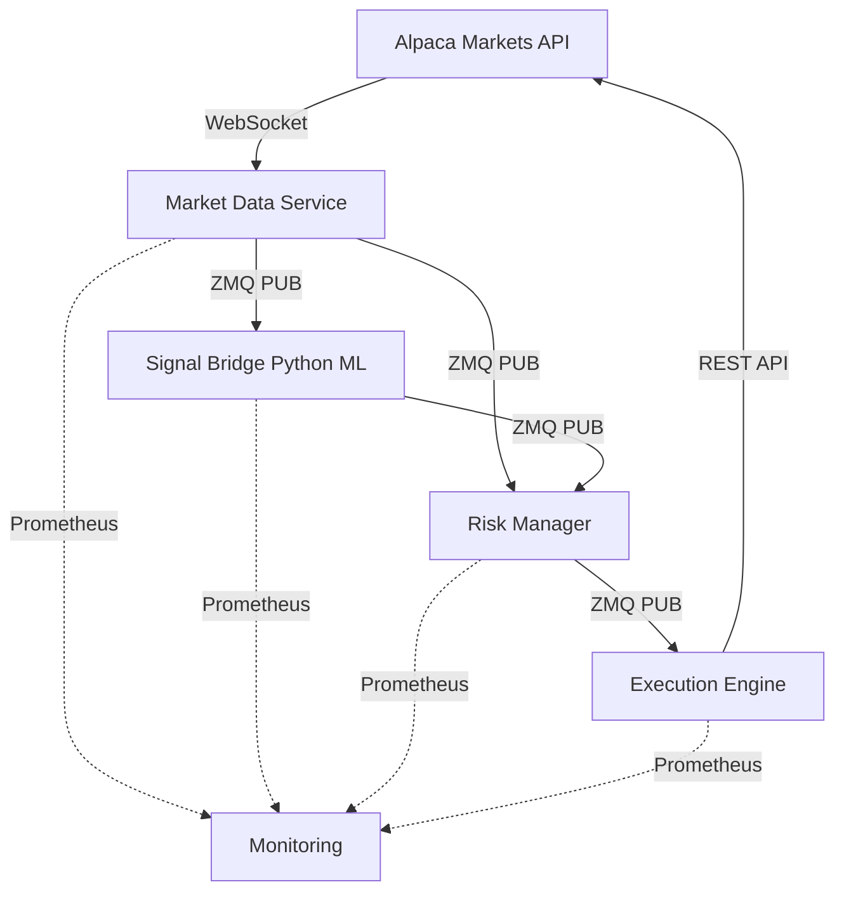
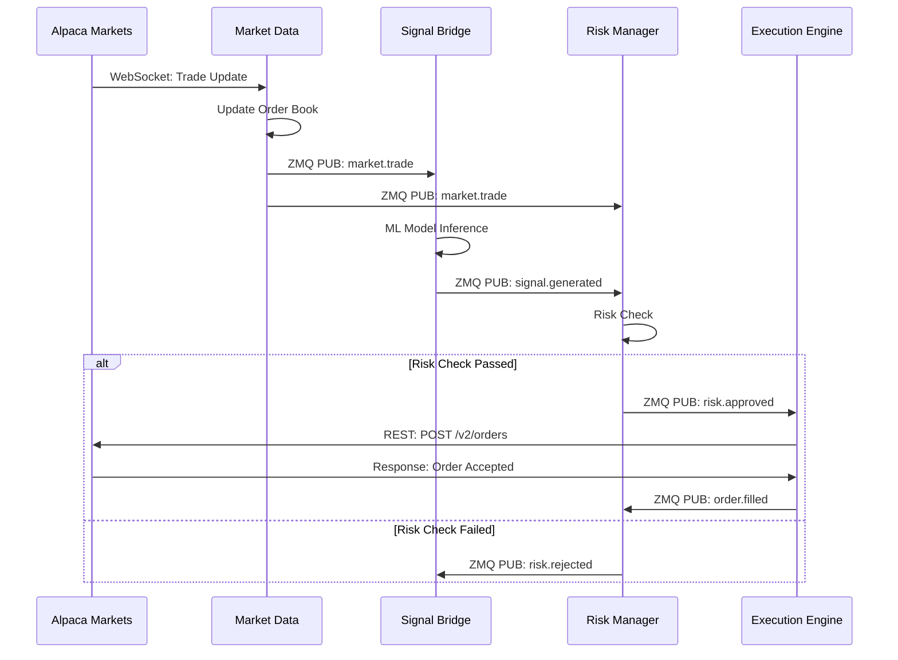

# System Architecture

This document describes the high-level architecture, design decisions, and data flows of the py_rt Algorithm Trading System.

## 🎯 Architecture Overview

The py_rt system implements a **hybrid Python-Rust architecture** that separates offline research/backtesting tasks (Python) from online low-latency trading execution (Rust). This design maximizes Python's productivity for research while leveraging Rust's performance for production trading.

## 📚 Table of Contents

1. [Architecture Overview](#architecture-overview)
2. [Python-Rust Separation](#python-rust-separation)
3. [Component Descriptions](#component-descriptions)
4. [Data Flow](#data-flow)
5. [Communication Patterns](#communication-patterns)
6. [Design Decisions](#design-decisions)
7. [Scalability](#scalability)
8. [Limitations](#limitations)
9. [Future Improvements](#future-improvements)

## 📖 Detailed Architecture Documentation

For comprehensive architecture documentation, see:

- **[/docs/architecture/python-rust-separation.md](/docs/architecture/python-rust-separation.md)** - Complete system design with Python offline and Rust online components
- **[/docs/architecture/component-diagram.md](/docs/architecture/component-diagram.md)** - C4 model diagrams showing component interactions
- **[/docs/architecture/integration-layer.md](/docs/architecture/integration-layer.md)** - PyO3 bindings, ZeroMQ messaging, and shared memory IPC

## Python-Rust Separation

The system is designed with a clear separation of concerns:

### Python (Offline)
- **Backtesting**: Historical data replay, strategy validation
- **Optimization**: Parameter tuning with Optuna, genetic algorithms
- **Machine Learning**: Model training with XGBoost, PyTorch
- **Analysis**: Statistical analysis, visualization, performance attribution
- **Research**: Jupyter notebooks, hypothesis testing

### Rust (Online)
- **Market Data**: Low-latency WebSocket ingestion, order book management
- **Execution**: Order routing, retry logic, slippage protection
- **Risk Management**: Pre-trade checks, position tracking, P&L monitoring
- **Signal Processing**: Real-time indicators, ML inference (ONNX)

### Integration Layer
- **PyO3**: Python-Rust bindings for performance-critical functions
- **ZeroMQ**: Pub/sub messaging for event-driven communication
- **Shared Memory**: Lock-free ring buffers for ultra-low-latency data transfer
- **Protocol Buffers**: Binary serialization for efficient data exchange

### Architecture Diagram

```
┌─────────────────────────────────────────────────────────────────────┐
│                         PYTHON OFFLINE                               │
│  Research → Backtesting → Optimization → ML Training → ONNX Export  │
└─────────────────────────────┬───────────────────────────────────────┘
                              │
                    ┌─────────▼─────────┐
                    │  PyO3 / ZeroMQ    │
                    │  Protocol Buffers │
                    └─────────┬─────────┘
                              │
┌─────────────────────────────▼───────────────────────────────────────┐
│                          RUST ONLINE                                │
│  Market Data → Signal Processing → Risk Checks → Order Execution   │
└─────────────────────────────────────────────────────────────────────┘
```

## Legacy Architecture Overview

The original system follows a **microservices architecture** with four independent components communicating via ZeroMQ (ZMQ) messaging. Each component is a separate Rust binary that can be deployed and scaled independently.

### High-Level Architecture



### Component Topology

```
┌─────────────────────────────────────────────────────────────┐
│                    Alpaca Markets Cloud                     │
│                 (WebSocket + REST API v2)                   │
└───────────────┬─────────────────────────────┬───────────────┘
                │                             │
                │ WebSocket                   │ REST API
                │ (Market Data)               │ (Orders)
                ▼                             ▲
    ┌─────────────────────┐         ┌─────────────────────┐
    │  Market Data        │         │  Execution Engine   │
    │  Service            │         │  - Order Router     │
    │  - WebSocket Client │         │  - Retry Logic      │
    │  - Order Book       │         │  - Slippage Check   │
    │  - Aggregation      │         │  - Rate Limiting    │
    │  - ZMQ Publisher    │         │                     │
    └──────────┬──────────┘         └──────────▲──────────┘
               │                               │
               │ ZMQ PUB (port 5555)          │ ZMQ SUB
               │ Topics: market.*             │ Topic: order.*
               │                               │
               ▼                               │
    ┌─────────────────────┐         ┌─────────────────────┐
    │  Signal Bridge      │         │  Risk Manager       │
    │  - PyO3 Bindings    │────────▶│  - Position Track   │
    │  - Python ML        │ ZMQ PUB │  - Risk Limits      │
    │  - Feature Eng.     │ (5556)  │  - Pre-trade Check  │
    │                     │         │  - P&L Tracking     │
    └─────────────────────┘         └─────────────────────┘
                                            │
                                            │ ZMQ PUB (5557)
                                            │ Topic: risk.*
                                            └─────────────────┘
```

## Component Descriptions

### 1. Market Data Service

**Responsibility**: Real-time market data ingestion and distribution

**Key Features**:
- WebSocket connection to Alpaca Markets data stream (v2)
- Maintains live order books for subscribed symbols
- Aggregates trades into OHLCV bars (multiple timeframes)
- Publishes market data via ZMQ PUB socket

**Implementation Details**:
- `websocket.rs`: Tokio-tungstenite WebSocket client with automatic reconnection
- `orderbook.rs`: Binary heap-based order book with O(log n) updates
- `aggregation.rs`: Time-based windowing for bar generation
- `publisher.rs`: ZMQ PUB socket wrapper with topic-based routing

**Performance**:
- Processes 50,000+ messages/second
- Order book updates in <50μs (p99)
- Memory: ~50MB for 100 symbols

**Configuration**:
```json
{
  "alpaca_api_key": "string",
  "alpaca_secret_key": "string",
  "zmq_pub_address": "tcp://*:5555",
  "symbols": ["AAPL", "MSFT"],
  "reconnect_delay_secs": 5
}
```

### 2. Signal Bridge

**Responsibility**: Python integration for ML-based signal generation

**Key Features**:
- PyO3 bindings expose Rust types to Python
- Subscribes to market data via ZMQ SUB
- Processes signals through Python ML models
- Publishes trading signals via ZMQ PUB

**Implementation Details**:
- `lib.rs`: PyO3 module with `#[pymodule]` attribute
- Exposes `Signal`, `Bar`, `Trade` types to Python
- Async runtime integration with Python's asyncio
- Technical indicators via `ta` crate

**Use Cases**:
1. **Feature Engineering**: Calculate technical indicators in Python
2. **ML Models**: scikit-learn, TensorFlow, PyTorch integration
3. **Custom Strategies**: Implement complex logic in Python

**Example Python Integration**:
```python
import signal_bridge

# Receive market data
bar = signal_bridge.receive_bar()

# Generate signal
if bar.close > bar.open * 1.01:
    signal = signal_bridge.Signal(
        symbol="AAPL",
        action="Buy",
        confidence=0.85
    )
    signal_bridge.publish_signal(signal)
```

**Performance**:
- Python GIL can limit throughput to ~1,000 signals/second
- Consider multi-process architecture for higher throughput

### 3. Risk Manager

**Responsibility**: Pre-trade risk checks and position tracking

**Key Features**:
- Validates orders against configurable risk limits
- Tracks open positions and realized/unrealized P&L
- Enforces maximum position size, order size, daily loss limits
- Publishes approved/rejected orders

**Implementation Details**:
- `lib.rs`: Core risk engine with position tracking
- In-memory position store (HashMap)
- Atomic risk checks with async/await

**Risk Checks**:
1. **Position Size Limit**: Maximum position value per symbol
2. **Order Size Limit**: Maximum single order value
3. **Daily Loss Limit**: Maximum unrealized loss in trading day
4. **Account Balance**: Sufficient buying power

**Configuration**:
```json
{
  "max_position_size": 10000.0,
  "max_order_size": 1000.0,
  "max_daily_loss": 5000.0,
  "zmq_sub_address": "tcp://localhost:5555",
  "zmq_pub_address": "tcp://*:5557"
}
```

**Example Risk Check Flow**:
```
Signal → Risk Manager → Check Limits → Approve/Reject → Publish
                             │
                             ├─ Position size OK?
                             ├─ Order size OK?
                             ├─ Daily loss OK?
                             └─ Account balance OK?
```

### 4. Execution Engine

**Responsibility**: Order execution through Alpaca Markets API

**Key Features**:
- Smart order routing with retry logic
- Slippage protection (rejects orders exceeding threshold)
- Rate limiting (200 requests/minute via `governor` crate)
- Order status tracking and updates

**Implementation Details**:
- `router.rs`: Order routing logic with async HTTP client (reqwest)
- `retry.rs`: Exponential backoff retry strategy (max 3 retries)
- `slippage.rs`: Compares limit order price to current market price

**Retry Strategy**:
```rust
// Exponential backoff: 1s, 2s, 4s
async fn retry_order(order: Order) -> Result<OrderResponse> {
    let mut delay = Duration::from_secs(1);
    for attempt in 0..3 {
        match execute_order(&order).await {
            Ok(response) => return Ok(response),
            Err(e) if is_retryable(&e) => {
                tokio::time::sleep(delay).await;
                delay *= 2;
            }
            Err(e) => return Err(e),
        }
    }
    Err(Error::MaxRetriesExceeded)
}
```

**Slippage Protection**:
```rust
// Reject limit orders with >50bps slippage
fn check_slippage(order: &Order, market_price: Price) -> bool {
    let slippage_bps = ((order.price - market_price) / market_price * 10000.0).abs();
    slippage_bps <= config.max_slippage_bps
}
```

**Configuration**:
```json
{
  "alpaca_api_key": "string",
  "alpaca_secret_key": "string",
  "max_retries": 3,
  "max_slippage_bps": 50,
  "rate_limit_per_minute": 200
}
```

## Data Flow

### End-to-End Order Flow



### Message Flow Diagram

```
Time: t0
  Alpaca Markets ─────────────▶ Market Data Service
                              (WebSocket: Trade Update)

Time: t0 + 50μs
  Market Data Service ─────────▶ Signal Bridge
  Market Data Service ─────────▶ Risk Manager
                              (ZMQ PUB: market.trade)

Time: t0 + 5ms
  Signal Bridge ───────────────▶ Risk Manager
                              (ZMQ PUB: signal.generated)

Time: t0 + 6ms
  Risk Manager ────────────────▶ Execution Engine
                              (ZMQ PUB: risk.approved)

Time: t0 + 10ms
  Execution Engine ────────────▶ Alpaca Markets
                              (REST: POST /v2/orders)

Total Latency: ~10ms (signal to execution)
```

## Communication Patterns

### ZeroMQ PUB/SUB Pattern

**Advantages**:
1. **Decoupling**: Publishers don't know about subscribers
2. **Scalability**: Add subscribers without modifying publishers
3. **Performance**: Zero-copy messaging, <10μs latency
4. **Reliability**: Automatic reconnection and buffering

**Topic-Based Routing**:
```rust
// Publisher (Market Data)
pub async fn publish_trade(&self, trade: Trade) {
    let topic = "market.trade";
    let message = Message::TradeUpdate(trade);
    let data = serde_json::to_vec(&message)?;
    self.socket.send_multipart([topic.as_bytes(), &data], 0)?;
}

// Subscriber (Risk Manager)
pub async fn subscribe(&mut self) {
    self.socket.set_subscribe(b"market.")?;
    self.socket.set_subscribe(b"signal.")?;

    loop {
        let msg = self.socket.recv_multipart(0)?;
        let topic = String::from_utf8(msg[0].clone())?;
        let data = &msg[1];
        self.handle_message(&topic, data).await?;
    }
}
```

**Message Topics**:
- `market.trade` - Trade updates
- `market.quote` - Quote updates
- `market.bar` - OHLCV bar updates
- `signal.generated` - Trading signals
- `risk.approved` - Risk-approved orders
- `risk.rejected` - Risk-rejected orders
- `order.submitted` - Orders sent to exchange
- `order.filled` - Order fill updates
- `system.heartbeat` - Component health checks

### Request/Reply Pattern (Future)

For synchronous operations (e.g., account balance queries):

```rust
// Client (Risk Manager)
let request = Message::BalanceRequest;
socket.send(serde_json::to_vec(&request)?)?;
let response: BalanceResponse = socket.recv_json()?;

// Server (Execution Engine)
let request: Message = socket.recv_json()?;
let balance = alpaca.get_account_balance().await?;
let response = Message::BalanceResponse(balance);
socket.send(serde_json::to_vec(&response)?)?;
```

## Design Decisions

### 1. Why Rust?

**Performance**:
- Zero-cost abstractions enable C++ performance without manual memory management
- No garbage collection pauses (critical for low-latency trading)
- LLVM-optimized machine code

**Safety**:
- Ownership system prevents data races at compile time
- No null pointer dereferences or use-after-free bugs
- Strong type system catches errors before production

**Concurrency**:
- Tokio async runtime provides efficient task scheduling
- Zero-cost async/await syntax
- fearless concurrency with Send/Sync traits

**Trade-offs**:
- Steeper learning curve compared to Python/Go
- Longer compile times (mitigated with incremental compilation)
- Smaller ecosystem compared to Java/C++

### 2. Why ZeroMQ?

**Performance**:
- Zero-copy messaging via shared memory
- <10μs message latency
- Millions of messages/second throughput

**Flexibility**:
- Multiple transport protocols (TCP, IPC, inproc)
- Various messaging patterns (PUB/SUB, REQ/REP, PUSH/PULL)
- Language-agnostic (Rust, Python, C++, Go, etc.)

**Reliability**:
- Automatic reconnection
- Configurable buffering and backpressure
- Fair queuing for subscribers

**Alternatives Considered**:
- **gRPC**: Higher latency (~100μs), requires code generation
- **NATS**: Requires external broker, added operational complexity
- **Kafka**: Too heavy for low-latency use case (ms latency)
- **Redis PUB/SUB**: Requires external server, no persistence

### 3. Why Workspace Architecture?

**Benefits**:
1. **Shared Dependencies**: Single `Cargo.lock` for reproducible builds
2. **Common Types**: `common` crate shared across all components
3. **Consistent Versioning**: Workspace-level version management
4. **Efficient Builds**: Cargo caches shared dependencies

**Structure**:
```
rust/
├── Cargo.toml           # Workspace root
├── common/              # Shared types and utilities
├── market-data/         # Independent binary
├── signal-bridge/       # Independent binary
├── risk-manager/        # Independent binary
└── execution-engine/    # Independent binary
```

### 4. Why PyO3 for Python Integration?

**Performance**:
- Near-native speed (10-100x faster than pure Python)
- Zero-copy data transfer between Rust and Python
- GIL management for concurrent access

**Flexibility**:
- Gradual migration path (start with Python, optimize critical paths in Rust)
- Leverage Python's ML ecosystem (scikit-learn, TensorFlow, PyTorch)
- Maintain type safety with pyo3 type annotations

**Alternative Considered**:
- **Native Python**: Too slow for high-frequency signal generation
- **Cython**: Requires compilation, less type safety
- **RESTful API**: Higher latency, serialization overhead

### 5. Why No Database?

**Current Design**:
- Positions stored in-memory (HashMap)
- No persistence across restarts

**Rationale**:
1. **Simplicity**: No database setup/maintenance
2. **Performance**: In-memory access is 100-1000x faster
3. **MVP Focus**: Sufficient for initial development

**Future Improvement**:
- Add PostgreSQL for position persistence
- Use TimescaleDB for time-series metrics
- Redis for shared state across instances

## Scalability

### Horizontal Scaling

Each component can scale independently:

```
┌─────────────────────┐
│  Market Data 1      │────┐
└─────────────────────┘    │
┌─────────────────────┐    │    ┌─────────────────────┐
│  Market Data 2      │────┼───▶│  Load Balancer      │
└─────────────────────┘    │    │  (HAProxy/NGINX)    │
┌─────────────────────┐    │    └─────────────────────┘
│  Market Data N      │────┘              │
└─────────────────────┘                   ▼
                                    ZMQ PUB socket
```

**Scaling Strategies**:

1. **Market Data**: Shard by symbol (e.g., instance 1 handles AAPL-MSFT, instance 2 handles GOOGL-AMZN)
2. **Signal Bridge**: Run multiple Python processes (avoid GIL contention)
3. **Risk Manager**: Shard by symbol or use distributed locking (Redis)
4. **Execution Engine**: Round-robin order distribution

### Vertical Scaling

**CPU**:
- Multi-threaded Tokio runtime scales to available cores
- CPU affinity can reduce context switching

**Memory**:
- Order books grow linearly with number of symbols (~500KB per symbol)
- Estimated memory: 100 symbols × 500KB = 50MB

**Network**:
- ZMQ supports 10Gbps+ throughput with proper tuning
- TCP_NODELAY disables Nagle's algorithm for lower latency

### Performance Tuning

**Rust Optimizations**:
```toml
[profile.release]
opt-level = 3              # Maximum optimization
lto = true                 # Link-time optimization
codegen-units = 1          # Single codegen unit (slower compile, faster runtime)
strip = true               # Remove debug symbols
```

**Tokio Tuning**:
```rust
// Increase worker threads
tokio::runtime::Builder::new_multi_thread()
    .worker_threads(8)
    .enable_all()
    .build()?;
```

**ZMQ Tuning**:
```rust
// Increase socket buffers
socket.set_sndhwm(10000)?;  // Send high-water mark
socket.set_rcvhwm(10000)?;  // Receive high-water mark
socket.set_tcp_keepalive(1)?;
```

## Limitations

### Current Limitations

1. **Single Exchange Support**
   - Only Alpaca Markets integration
   - Cannot aggregate liquidity across exchanges

2. **No Position Persistence**
   - Positions lost on restart
   - Risk exposure during recovery

3. **Simple Risk Model**
   - Position-based limits only
   - No portfolio-level VaR or Greeks

4. **No Backtesting**
   - Live trading only
   - Cannot validate strategies on historical data

5. **Limited Observability**
   - Basic Prometheus metrics
   - No distributed tracing (Jaeger/Zipkin)

6. **No High Availability**
   - Single point of failure for each component
   - No leader election or failover

### Known Issues

1. **WebSocket Reconnection**: 5-second delay on disconnect (Alpaca limitation)
2. **Python GIL**: Signal generation limited to ~1,000/second
3. **Rate Limiting**: Alpaca API limits to 200 requests/minute

## Future Improvements

### Short-Term (Q1 2024)

1. **Position Persistence**
   - PostgreSQL integration
   - Automatic recovery on restart

2. **Enhanced Risk Management**
   - Portfolio-level risk (VaR, Expected Shortfall)
   - Greeks calculation for options
   - Correlation-based position limits

3. **Multi-Exchange Support**
   - Binance integration (crypto)
   - Interactive Brokers (stocks, futures, options)

### Medium-Term (Q2-Q3 2024)

4. **Backtesting Framework**
   - Historical data replay
   - Strategy performance metrics
   - Parameter optimization

5. **Web Dashboard**
   - React-based monitoring UI
   - Real-time position tracking
   - P&L visualization

6. **Distributed Tracing**
   - Jaeger integration
   - Request ID propagation
   - Performance profiling

### Long-Term (Q4 2024+)

7. **High Availability**
   - Raft consensus for leader election
   - Automatic failover
   - State replication

8. **Machine Learning Pipeline**
   - Feature store (Feast)
   - Model serving (Seldon Core)
   - A/B testing framework

9. **Options Trading**
   - Greeks calculation
   - Volatility surface modeling
   - Multi-leg strategies

## References

- [Alpaca Markets API Documentation](https://alpaca.markets/docs/api-documentation/)
- [ZeroMQ Guide](https://zguide.zeromq.org/)
- [Tokio Documentation](https://tokio.rs/tokio/tutorial)
- [PyO3 Guide](https://pyo3.rs/v0.20.0/)
- [Rust Performance Book](https://nnethercote.github.io/perf-book/)

---

**Last Updated**: 2024-10-14 | **Version**: 0.1.0
