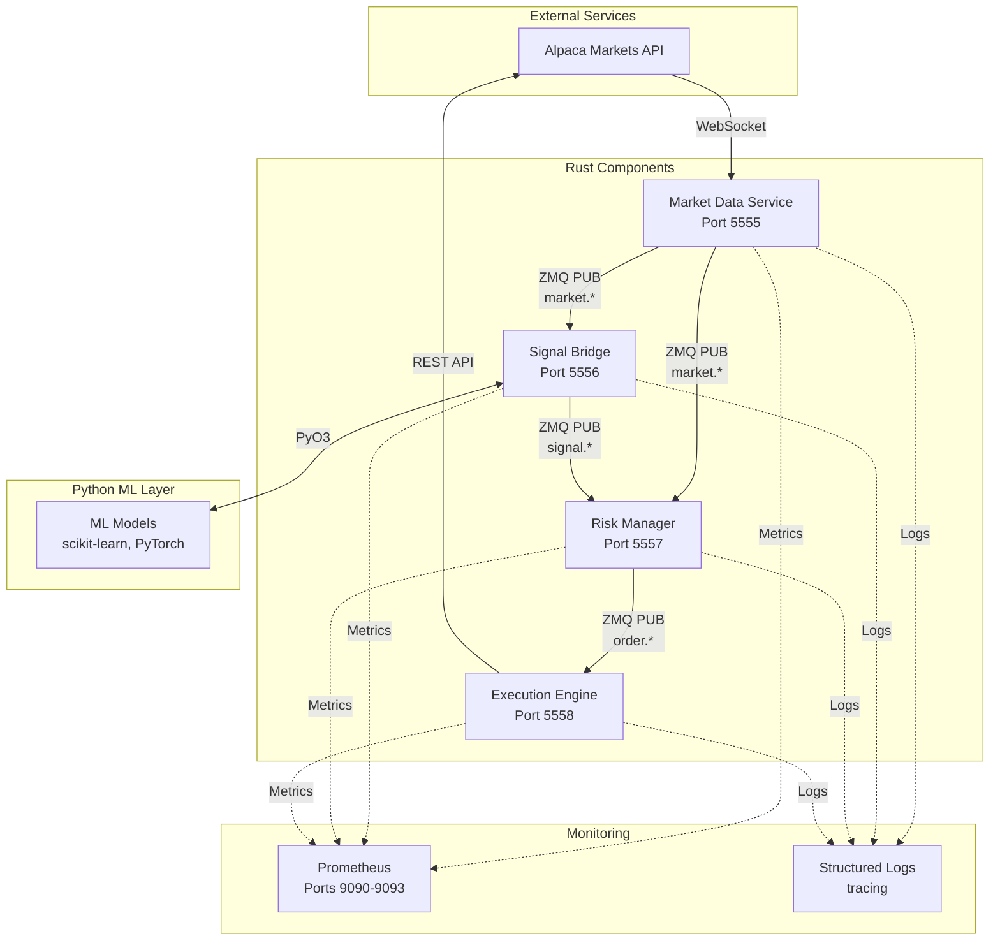
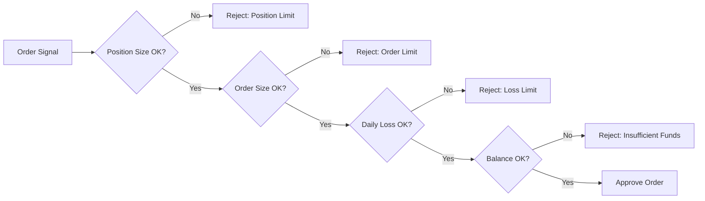
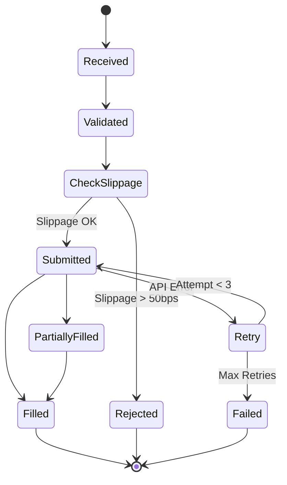

# System Architecture Overview

This document provides a comprehensive overview of the py_rt trading system architecture, design decisions, and technical rationale.

## High-Level Architecture

The py_rt system follows a **microservices architecture** with four independent components communicating via ZeroMQ messaging. This design enables horizontal scalability, fault isolation, and independent deployment.



## Design Philosophy

### 1. Language Selection: Rust + Python

**Rust for Critical Path**:
- Market data processing (low latency required)
- Order execution (reliability critical)
- Risk management (safety critical)

**Python for Strategy Development**:
- ML model development (rich ecosystem)
- Backtesting (rapid iteration)
- Data analysis (pandas, numpy)

**Integration via PyO3**:
- Zero-copy data transfer
- Type-safe bindings
- Native performance

### 2. Messaging: ZeroMQ

**Why ZeroMQ over alternatives?**

| Feature | ZeroMQ | gRPC | Kafka | Redis |
|---------|--------|------|-------|-------|
| Latency | <10μs | ~100μs | ~5ms | ~50μs |
| Throughput | 10M+ msg/s | 100K msg/s | 1M msg/s | 500K msg/s |
| Deployment | Embedded | Service mesh | Broker cluster | Broker |
| Protocol | PUB/SUB, REQ/REP | RPC | Stream | PUB/SUB |
| Best for | Low latency | Microservices | Event sourcing | Caching |

**Decision**: ZeroMQ chosen for sub-10μs latency and no external dependencies.

### 3. Architecture Pattern: Event-Driven

**Pub/Sub Pattern Benefits**:
- Loose coupling between components
- Easy to add new subscribers
- Natural backpressure handling
- Topic-based filtering

**Message Flow**:
```
Market Data → Signal Generation → Risk Check → Order Execution
     |              |                  |              |
     └──────────────┴──────────────────┴──────────────┘
              (All async via ZMQ PUB/SUB)
```

## Component Architecture

### 1. Market Data Service

**Responsibility**: Real-time market data ingestion and distribution

**Internal Architecture**:
```
┌─────────────────────────────────────────┐
│        Market Data Service              │
├─────────────────────────────────────────┤
│  ┌─────────────┐     ┌──────────────┐  │
│  │  WebSocket  │────▶│  Order Book  │  │
│  │   Client    │     │   Manager    │  │
│  └─────────────┘     └──────┬───────┘  │
│                              │          │
│  ┌─────────────┐     ┌──────▼───────┐  │
│  │ Aggregation │     │  Publisher   │  │
│  │   Engine    │────▶│   (ZMQ)      │  │
│  └─────────────┘     └──────────────┘  │
└─────────────────────────────────────────┘
```

**Key Data Structures**:
- **Order Book**: Binary heap (O(log n) updates)
- **Bar Aggregator**: Time-window based bucketing
- **Message Queue**: Lock-free ring buffer

**Performance Characteristics**:
- Processes 50,000+ messages/second
- Order book update latency: <50μs (p99)
- Memory: ~500KB per symbol

### 2. Signal Bridge

**Responsibility**: Python ML integration for signal generation

**Architecture**:
```
┌────────────────────────────────────────┐
│         Signal Bridge                  │
├────────────────────────────────────────┤
│  Rust Layer          Python Layer      │
│  ┌──────────┐       ┌──────────┐      │
│  │   ZMQ    │──────▶│   ML     │      │
│  │   SUB    │ PyO3  │  Model   │      │
│  └──────────┘       └────┬─────┘      │
│                           │            │
│  ┌──────────┐       ┌────▼─────┐      │
│  │   ZMQ    │◀──────│ Feature  │      │
│  │   PUB    │ PyO3  │   Eng.   │      │
│  └──────────┘       └──────────┘      │
└────────────────────────────────────────┘
```

**PyO3 Integration**:
```rust
#[pyclass]
pub struct Bar {
    #[pyo3(get)]
    pub symbol: String,
    #[pyo3(get)]
    pub open: f64,
    #[pyo3(get)]
    pub high: f64,
    #[pyo3(get)]
    pub low: f64,
    #[pyo3(get)]
    pub close: f64,
    #[pyo3(get)]
    pub volume: u64,
}

#[pymethods]
impl Bar {
    #[new]
    fn new(symbol: String, open: f64, high: f64,
           low: f64, close: f64, volume: u64) -> Self {
        Bar { symbol, open, high, low, close, volume }
    }
}
```

**Performance Considerations**:
- Python GIL limits to ~1,000 signals/second
- Use multiprocessing for higher throughput
- Zero-copy data transfer via PyO3

### 3. Risk Manager

**Responsibility**: Pre-trade risk checks and position tracking

**Risk Check Pipeline**:


**Risk Limits Configuration**:
```rust
pub struct RiskLimits {
    /// Maximum position value per symbol
    pub max_position_size: f64,
    /// Maximum single order value
    pub max_order_size: f64,
    /// Maximum daily unrealized loss
    pub max_daily_loss: f64,
    /// Maximum portfolio concentration (%)
    pub position_limit_pct: f64,
}
```

**Position Tracking**:
```rust
pub struct Position {
    pub symbol: String,
    pub quantity: i64,
    pub avg_price: f64,
    pub market_value: f64,
    pub unrealized_pnl: f64,
    pub realized_pnl: f64,
}
```

### 4. Execution Engine

**Responsibility**: Smart order routing to Alpaca Markets

**Order Lifecycle**:


**Retry Strategy**:
```rust
pub async fn retry_order(order: Order) -> Result<OrderResponse> {
    let mut delay = Duration::from_secs(1);
    for attempt in 0..MAX_RETRIES {
        match execute_order(&order).await {
            Ok(response) => return Ok(response),
            Err(e) if is_retryable(&e) => {
                warn!("Order failed (attempt {}), retrying...", attempt);
                tokio::time::sleep(delay).await;
                delay *= 2; // Exponential backoff
            }
            Err(e) => return Err(e),
        }
    }
    Err(Error::MaxRetriesExceeded)
}
```

**Rate Limiting**:
- Uses `governor` crate for token bucket algorithm
- 200 requests/minute limit (Alpaca constraint)
- Automatic request queuing

## Data Flow

### End-to-End Message Flow

```
t0: Market update arrives
  Alpaca WebSocket ─────────▶ Market Data Service
                              (Deserialize JSON: ~20μs)

t0 + 20μs: Order book updated
  Market Data Service ────────▶ Update Order Book
                              (Binary heap insert: ~5μs)

t0 + 25μs: Publish to subscribers
  Market Data Service ────────▶ ZMQ Publish
                              (Serialize + Send: ~10μs)

t0 + 35μs: Signal generation
  Signal Bridge ──────────────▶ Python ML Model
                              (Inference: ~3ms)

t0 + 3.035ms: Signal published
  Signal Bridge ──────────────▶ ZMQ Publish
                              (Send: ~10μs)

t0 + 3.045ms: Risk check
  Risk Manager ───────────────▶ Validate Limits
                              (Check: ~50μs)

t0 + 3.095ms: Execute order
  Execution Engine ───────────▶ Alpaca REST API
                              (HTTP POST: ~1.5ms)

t0 + 4.595ms: Order confirmed
  Alpaca Markets ─────────────▶ Order Response
                              (HTTP Response: ~500μs)

Total Latency: ~5ms (signal to execution)
```

## Scalability

### Horizontal Scaling Strategy

**Market Data Service**:
```
Symbol Sharding:
  Instance 1: AAPL, MSFT, GOOGL
  Instance 2: AMZN, FB, TSLA
  Instance 3: NFLX, NVDA, AMD
```

**Signal Bridge**:
```
Multi-Process Python:
  Process 1: Momentum strategies
  Process 2: Mean reversion strategies
  Process 3: ML-based strategies
```

**Risk Manager**:
```
Symbol-Based Sharding:
  Instance 1: Handles AAPL-MSFT positions
  Instance 2: Handles GOOGL-AMZN positions
  (Requires distributed lock for portfolio-level limits)
```

**Execution Engine**:
```
Round-Robin Distribution:
  Instance 1, 2, 3: Share order load
  (Stateless, can scale freely)
```

### Performance Tuning

**Rust Compiler Optimizations**:
```toml
[profile.release]
opt-level = 3           # Maximum optimization
lto = "fat"            # Link-time optimization
codegen-units = 1       # Single codegen unit
strip = true            # Remove debug symbols
panic = "abort"         # No unwinding
```

**Tokio Runtime Tuning**:
```rust
tokio::runtime::Builder::new_multi_thread()
    .worker_threads(num_cpus::get())
    .thread_stack_size(3 * 1024 * 1024)
    .enable_all()
    .build()?
```

**ZMQ Socket Tuning**:
```rust
socket.set_sndhwm(10000)?;    // Send buffer: 10k messages
socket.set_rcvhwm(10000)?;    // Recv buffer: 10k messages
socket.set_tcp_nodelay(true)?; // Disable Nagle's algorithm
socket.set_linger(0)?;         // Don't block on close
```

## Design Trade-offs

### 1. In-Memory vs Persistent Storage

**Current**: In-memory position tracking
**Pros**:
- 100-1000x faster than database
- Simpler deployment (no database setup)
- Lower operational complexity

**Cons**:
- Positions lost on restart
- Cannot recover state after crash
- No historical position data

**Future**: Add PostgreSQL for persistence while keeping in-memory cache for performance.

### 2. No High Availability

**Current**: Single instance per component
**Pros**:
- Simpler deployment
- No consensus overhead
- Easier to debug

**Cons**:
- Single point of failure
- Downtime during restarts
- No automatic failover

**Future**: Add Raft consensus for leader election and state replication.

### 3. Simple Risk Model

**Current**: Position-based limits only
**Pros**:
- Fast checks (<50μs)
- Easy to understand
- Deterministic behavior

**Cons**:
- No portfolio-level risk (VaR, Greeks)
- No correlation analysis
- Cannot handle complex products (options)

**Future**: Add portfolio VaR, Greeks calculation, and multi-asset risk models.

## Technology Decisions

### Why Tokio?

**Alternatives Considered**:
- **async-std**: Less mature, smaller ecosystem
- **Threads**: Higher overhead, harder to scale
- **Actix**: Actor model adds complexity

**Decision**: Tokio provides best performance with mature ecosystem.

### Why Not Database?

**Alternatives Considered**:
- **PostgreSQL**: Too slow for real-time position updates
- **Redis**: Network latency adds 100-500μs
- **RocksDB**: Disk I/O bottleneck

**Decision**: In-memory for MVP, add persistence layer in v2.

### Why Not Kubernetes?

**Alternatives Considered**:
- **Docker Compose**: Simpler, sufficient for development
- **Systemd**: Native Linux, lower overhead
- **Kubernetes**: Overkill for 4 services

**Decision**: Start with systemd, migrate to k8s when scaling to 20+ services.

## Next Steps

- [Component Details](components.md) - Deep dive into each component
- [Data Flow](dataflow.md) - Message flow diagrams
- [Deployment Guide](deployment.md) - Production deployment

---

**Last Updated**: 2025-10-14
