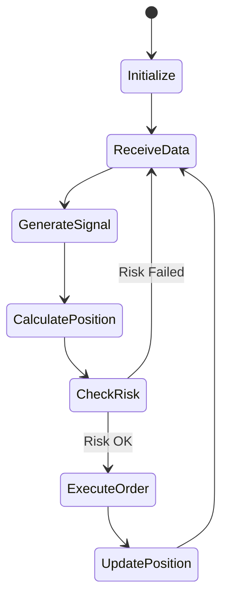

# Strategy Development Guide

Learn how to develop, test, and deploy trading strategies in the py_rt system.

## Table of Contents

1. [Introduction](#introduction)
2. [Strategy Basics](#strategy-basics)
3. [Creating Your First Strategy](#creating-your-first-strategy)
4. [Advanced Strategies](#advanced-strategies)
5. [ML Integration](#ml-integration)
6. [Backtesting](#backtesting)
7. [Risk Management](#risk-management)
8. [Deployment](#deployment)

## Introduction

The py_rt system supports multiple types of trading strategies:

- **Technical Indicators**: Moving averages, RSI, MACD, etc.
- **Statistical**: Mean reversion, pairs trading, arbitrage
- **Machine Learning**: Price prediction, trend classification
- **Hybrid**: Combining multiple approaches

All strategies inherit from the `Strategy` base class and implement a common interface.

## Strategy Basics

### Strategy Lifecycle



### Base Strategy Class

Every strategy extends the `Strategy` base class:

```python
from abc import ABC, abstractmethod
from typing import Optional
import pandas as pd

class Strategy(ABC):
    """Abstract base class for all trading strategies."""

    def __init__(self, name: str):
        """Initialize strategy.

        Args:
            name: Strategy identifier
        """
        self.name = name
        self.positions = {}
        self.pnl = 0.0

    @abstractmethod
    def generate_signals(self, data: pd.DataFrame) -> pd.Series:
        """Generate trading signals from market data.

        Args:
            data: DataFrame with OHLCV data

        Returns:
            Series with signals: 1 (buy), -1 (sell), 0 (hold)
        """
        pass

    @abstractmethod
    def calculate_position_size(self,
                               signal: int,
                               capital: float,
                               price: float) -> int:
        """Calculate number of shares to trade.

        Args:
            signal: Trading signal (1, -1, or 0)
            capital: Available capital
            price: Current price

        Returns:
            Number of shares (positive for buy, negative for sell)
        """
        pass

    def on_bar(self, bar: dict) -> Optional[dict]:
        """Called when new bar arrives.

        Args:
            bar: Bar data dict with OHLCV

        Returns:
            Order dict or None
        """
        pass

    def on_fill(self, fill: dict):
        """Called when order is filled.

        Args:
            fill: Fill data dict
        """
        pass
```

## Creating Your First Strategy

Let's create a simple **Moving Average Crossover** strategy.

### Step 1: Define Strategy Class

```python
from src.strategies.base import Strategy
import pandas as pd
import numpy as np

class MovingAverageCrossover(Strategy):
    """Moving average crossover strategy.

    Generates buy signal when short MA crosses above long MA.
    Generates sell signal when short MA crosses below long MA.
    """

    def __init__(self,
                 short_window: int = 10,
                 long_window: int = 30,
                 position_pct: float = 0.1):
        """Initialize strategy.

        Args:
            short_window: Short MA window size
            long_window: Long MA window size
            position_pct: % of capital to use per trade
        """
        super().__init__("MA_Crossover")
        self.short_window = short_window
        self.long_window = long_window
        self.position_pct = position_pct

        # Validation
        if short_window >= long_window:
            raise ValueError("Short window must be < long window")

    def generate_signals(self, data: pd.DataFrame) -> pd.Series:
        """Generate trading signals."""
        # Calculate moving averages
        short_ma = data['close'].rolling(self.short_window).mean()
        long_ma = data['close'].rolling(self.long_window).mean()

        # Generate signals
        signals = pd.Series(0, index=data.index)

        # Buy when short MA crosses above long MA
        signals[(short_ma > long_ma) & (short_ma.shift(1) <= long_ma.shift(1))] = 1

        # Sell when short MA crosses below long MA
        signals[(short_ma < long_ma) & (short_ma.shift(1) >= long_ma.shift(1))] = -1

        return signals

    def calculate_position_size(self,
                               signal: int,
                               capital: float,
                               price: float) -> int:
        """Calculate position size."""
        if signal == 0:
            return 0

        # Use fixed % of capital
        position_value = capital * self.position_pct
        shares = int(position_value / price)

        return shares * signal  # Positive for buy, negative for sell
```

### Step 2: Test with Sample Data

```python
from src.data.fetcher import DataFetcher
from datetime import datetime, timedelta

# Fetch historical data
fetcher = DataFetcher()
end_date = datetime.now()
start_date = end_date - timedelta(days=365)

data = fetcher.get_bars(
    symbol="AAPL",
    start=start_date,
    end=end_date,
    timeframe="1Day"
)

# Initialize strategy
strategy = MovingAverageCrossover(
    short_window=10,
    long_window=30,
    position_pct=0.1
)

# Generate signals
signals = strategy.generate_signals(data)

# Print signal summary
print(f"Total signals: {len(signals[signals != 0])}")
print(f"Buy signals: {len(signals[signals == 1])}")
print(f"Sell signals: {len(signals[signals == -1])}")
```

### Step 3: Backtest Strategy

```python
from src.backtesting.engine import BacktestEngine
from src.backtesting.metrics import calculate_metrics

# Initialize backtest engine
engine = BacktestEngine(
    initial_capital=100000.0,
    commission=0.001,  # 0.1%
    slippage=0.0005    # 0.05%
)

# Run backtest
results = engine.run(strategy, data)

# Calculate performance metrics
metrics = calculate_metrics(results)

print("\n=== Backtest Results ===")
print(f"Total Return: {metrics['total_return']:.2%}")
print(f"Sharpe Ratio: {metrics['sharpe_ratio']:.2f}")
print(f"Max Drawdown: {metrics['max_drawdown']:.2%}")
print(f"Win Rate: {metrics['win_rate']:.2%}")
print(f"Profit Factor: {metrics['profit_factor']:.2f}")
```

## Advanced Strategies

### Mean Reversion Strategy

```python
class MeanReversion(Strategy):
    """Mean reversion strategy using Bollinger Bands."""

    def __init__(self,
                 window: int = 20,
                 num_std: float = 2.0,
                 position_pct: float = 0.1):
        super().__init__("Mean_Reversion")
        self.window = window
        self.num_std = num_std
        self.position_pct = position_pct

    def generate_signals(self, data: pd.DataFrame) -> pd.Series:
        """Generate signals using Bollinger Bands."""
        # Calculate Bollinger Bands
        sma = data['close'].rolling(self.window).mean()
        std = data['close'].rolling(self.window).std()

        upper_band = sma + (std * self.num_std)
        lower_band = sma - (std * self.num_std)

        signals = pd.Series(0, index=data.index)

        # Buy when price touches lower band (oversold)
        signals[data['close'] <= lower_band] = 1

        # Sell when price touches upper band (overbought)
        signals[data['close'] >= upper_band] = -1

        # Exit when price returns to mean
        signals[(data['close'] > lower_band) & (data['close'] < upper_band)] = 0

        return signals
```

### Momentum Strategy

```python
class Momentum(Strategy):
    """Momentum strategy using RSI and MACD."""

    def __init__(self,
                 rsi_period: int = 14,
                 rsi_oversold: int = 30,
                 rsi_overbought: int = 70,
                 macd_fast: int = 12,
                 macd_slow: int = 26,
                 macd_signal: int = 9):
        super().__init__("Momentum")
        self.rsi_period = rsi_period
        self.rsi_oversold = rsi_oversold
        self.rsi_overbought = rsi_overbought
        self.macd_fast = macd_fast
        self.macd_slow = macd_slow
        self.macd_signal = macd_signal

    def calculate_rsi(self, prices: pd.Series) -> pd.Series:
        """Calculate RSI indicator."""
        delta = prices.diff()
        gain = (delta.where(delta > 0, 0)).rolling(self.rsi_period).mean()
        loss = (-delta.where(delta < 0, 0)).rolling(self.rsi_period).mean()

        rs = gain / loss
        rsi = 100 - (100 / (1 + rs))
        return rsi

    def calculate_macd(self, prices: pd.Series) -> tuple:
        """Calculate MACD indicator."""
        exp1 = prices.ewm(span=self.macd_fast).mean()
        exp2 = prices.ewm(span=self.macd_slow).mean()
        macd = exp1 - exp2
        signal = macd.ewm(span=self.macd_signal).mean()
        histogram = macd - signal

        return macd, signal, histogram

    def generate_signals(self, data: pd.DataFrame) -> pd.Series:
        """Generate signals using RSI and MACD."""
        rsi = self.calculate_rsi(data['close'])
        macd, signal, histogram = self.calculate_macd(data['close'])

        signals = pd.Series(0, index=data.index)

        # Buy when RSI oversold AND MACD crosses above signal
        buy_condition = (
            (rsi < self.rsi_oversold) &
            (histogram > 0) &
            (histogram.shift(1) <= 0)
        )

        # Sell when RSI overbought AND MACD crosses below signal
        sell_condition = (
            (rsi > self.rsi_overbought) &
            (histogram < 0) &
            (histogram.shift(1) >= 0)
        )

        signals[buy_condition] = 1
        signals[sell_condition] = -1

        return signals
```

## ML Integration

### Price Prediction Strategy

```python
from src.strategies.ml.models.price_predictor import PricePredictor
from src.strategies.ml.features.feature_engineering import FeatureEngineer

class MLPriceStrategy(Strategy):
    """ML-based price prediction strategy."""

    def __init__(self,
                 lookback_window: int = 20,
                 prediction_horizon: int = 5,
                 confidence_threshold: float = 0.6):
        super().__init__("ML_Price_Prediction")
        self.lookback_window = lookback_window
        self.prediction_horizon = prediction_horizon
        self.confidence_threshold = confidence_threshold

        # Initialize ML components
        self.feature_eng = FeatureEngineer()
        self.model = PricePredictor(
            lookback_window=lookback_window,
            prediction_horizon=prediction_horizon
        )
        self.is_trained = False

    def train(self, historical_data: pd.DataFrame):
        """Train ML model on historical data."""
        # Create features
        features = self.feature_eng.create_features(historical_data)

        # Split train/test
        X_train, X_test, y_train, y_test = self.feature_eng.train_test_split(
            features, test_size=0.2
        )

        # Train model
        self.model.fit(X_train, y_train)

        # Validate
        score = self.model.score(X_test, y_test)
        print(f"Model R² score: {score:.4f}")

        self.is_trained = True

    def generate_signals(self, data: pd.DataFrame) -> pd.Series:
        """Generate signals using ML predictions."""
        if not self.is_trained:
            raise ValueError("Model must be trained before generating signals")

        # Create features for prediction
        features = self.feature_eng.create_features(data)

        # Get predictions
        predictions = self.model.predict(features)
        confidence = self.model.predict_confidence(features)

        signals = pd.Series(0, index=data.index)

        # Buy if predicted price increase > threshold with high confidence
        buy_condition = (
            (predictions > data['close'] * 1.02) &
            (confidence > self.confidence_threshold)
        )

        # Sell if predicted price decrease > threshold with high confidence
        sell_condition = (
            (predictions < data['close'] * 0.98) &
            (confidence > self.confidence_threshold)
        )

        signals[buy_condition] = 1
        signals[sell_condition] = -1

        return signals
```

### Usage Example

```python
# Fetch data
data = fetcher.get_bars("AAPL", start_date, end_date)

# Initialize and train strategy
strategy = MLPriceStrategy(
    lookback_window=20,
    prediction_horizon=5,
    confidence_threshold=0.7
)

# Train on first 80% of data
split_idx = int(len(data) * 0.8)
strategy.train(data[:split_idx])

# Backtest on remaining 20%
results = engine.run(strategy, data[split_idx:])
```

## Backtesting

See [Backtesting Guide](backtesting.md) for comprehensive backtesting documentation.

### Quick Example

```python
# Run basic backtest
results = engine.run(strategy, data)

# Run walk-forward analysis
wf_results = engine.run_walk_forward(
    strategy=strategy,
    data=data,
    train_period=252,  # 1 year training
    test_period=63     # 3 months testing
)

# Plot results
from src.backtesting.visualization import plot_results

plot_results(results, save_path="docs/images/backtest_results.png")
```

## Risk Management

### Position Sizing

```python
def calculate_position_size(self,
                           signal: int,
                           capital: float,
                           price: float) -> int:
    """Calculate position size using Kelly Criterion."""
    if signal == 0:
        return 0

    # Kelly Criterion: f = (p * b - q) / b
    # where p = win probability, q = loss probability, b = win/loss ratio
    win_prob = 0.55
    loss_prob = 0.45
    win_loss_ratio = 1.5

    kelly_fraction = (win_prob * win_loss_ratio - loss_prob) / win_loss_ratio

    # Use half Kelly for safety
    position_pct = kelly_fraction * 0.5

    # Calculate shares
    position_value = capital * position_pct
    shares = int(position_value / price)

    return shares * signal
```

### Stop Loss / Take Profit

```python
class StrategyWithStops(Strategy):
    """Strategy with stop loss and take profit."""

    def __init__(self, stop_loss_pct: float = 0.02,
                 take_profit_pct: float = 0.05):
        super().__init__("Strategy_With_Stops")
        self.stop_loss_pct = stop_loss_pct
        self.take_profit_pct = take_profit_pct
        self.entry_prices = {}

    def on_fill(self, fill: dict):
        """Track entry prices."""
        symbol = fill['symbol']
        price = fill['price']
        self.entry_prices[symbol] = price

    def check_stops(self, symbol: str, current_price: float) -> Optional[int]:
        """Check if stop loss or take profit triggered."""
        if symbol not in self.entry_prices:
            return None

        entry_price = self.entry_prices[symbol]
        pnl_pct = (current_price - entry_price) / entry_price

        # Stop loss
        if pnl_pct <= -self.stop_loss_pct:
            return -1  # Exit position

        # Take profit
        if pnl_pct >= self.take_profit_pct:
            return -1  # Exit position

        return None
```

## Deployment

### Save Strategy Configuration

```python
import json

strategy_config = {
    "name": "MA_Crossover_AAPL",
    "class": "MovingAverageCrossover",
    "parameters": {
        "short_window": 10,
        "long_window": 30,
        "position_pct": 0.1
    },
    "symbols": ["AAPL"],
    "timeframe": "1Day"
}

with open("config/strategies/ma_crossover.json", "w") as f:
    json.dump(strategy_config, f, indent=2)
```

### Load and Run

```python
def load_strategy(config_path: str) -> Strategy:
    """Load strategy from configuration file."""
    with open(config_path) as f:
        config = json.load(f)

    # Dynamic import
    module = __import__(f"src.strategies.{config['class'].lower()}")
    StrategyClass = getattr(module, config['class'])

    # Initialize with parameters
    return StrategyClass(**config['parameters'])

# Load and run
strategy = load_strategy("config/strategies/ma_crossover.json")
```

## Next Steps

- [Backtesting Guide](backtesting.md) - Test strategies thoroughly
- [ML Integration Guide](ml-integration.md) - Advanced ML strategies
- [Risk Management Guide](risk-management.md) - Configure risk controls
- [API Reference](../api/python/strategies.md) - Detailed API docs

---

**Last Updated**: 2025-10-14
