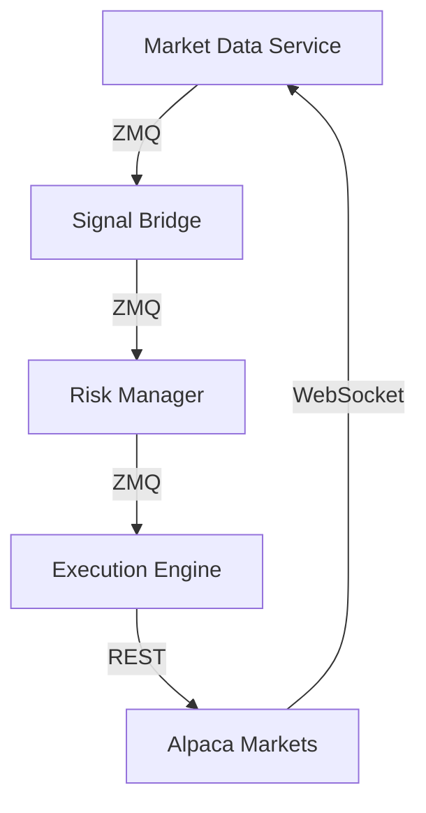

# py_rt Trading System Documentation

Welcome to the comprehensive documentation for the **py_rt** (Python + Rust Trading) system - a high-performance algorithmic trading platform combining Python's ML ecosystem with Rust's speed and safety.

## Quick Navigation

### Getting Started
- [Quick Start Guide](guides/quickstart.md) - Get up and running in 10 minutes
- [Installation](guides/installation.md) - Detailed installation instructions
- [Configuration Guide](guides/configuration.md) - System configuration
- [First Strategy](guides/first-strategy.md) - Build your first trading strategy

### Architecture
- [System Overview](architecture/overview.md) - High-level architecture
- [Component Design](architecture/components.md) - Detailed component descriptions
- [Data Flow](architecture/dataflow.md) - Message flow and communication
- [Deployment](architecture/deployment.md) - Production deployment guide

### API Reference
- [Python API](api/python/index.md) - Python modules and classes
- [Rust API](api/rust/index.md) - Rust crates and types
- [REST API](api/rest/index.md) - REST endpoints
- [WebSocket API](api/websocket/index.md) - WebSocket protocol
- [ZMQ Messages](api/zmq/index.md) - ZeroMQ message formats

### Development
- [Contributing](developer/contributing.md) - How to contribute
- [Code Style](developer/code-style.md) - Coding standards
- [Testing](developer/testing.md) - Testing strategies
- [Performance Tuning](developer/performance.md) - Optimization guide
- [Troubleshooting](developer/troubleshooting.md) - Common issues

### User Guides
- [Strategy Development](guides/strategy-development.md) - Build trading strategies
- [Backtesting](guides/backtesting.md) - Test strategies on historical data
- [ML Integration](guides/ml-integration.md) - Integrate ML models
- [Risk Management](guides/risk-management.md) - Configure risk limits
- [Monitoring](guides/monitoring.md) - System monitoring and alerts

## What is py_rt?

py_rt is a hybrid trading system that combines:

- **Python** for strategy development, ML models, and backtesting
- **Rust** for low-latency execution, risk management, and market data processing
- **ZeroMQ** for high-performance inter-process communication
- **Alpaca Markets API** for live trading and market data

### Key Features

- **Low Latency**: Sub-5ms end-to-end order execution
- **Type Safety**: Compile-time guarantees across Rust and Python
- **ML Ready**: PyO3 bindings for seamless Python ML integration
- **Risk Controls**: Pre-trade risk checks and circuit breakers
- **Observability**: Prometheus metrics and structured logging
- **Scalable**: Microservices architecture scales horizontally

## System Components

1. **Market Data Service** (Rust) - Real-time market data ingestion
2. **Signal Bridge** (Rust + Python) - ML-based signal generation
3. **Risk Manager** (Rust) - Pre-trade risk checks and position tracking
4. **Execution Engine** (Rust) - Smart order routing and execution

## Performance

- **Market Data Processing**: 50,000+ updates/second
- **Order Book Updates**: <50μs latency (p99)
- **Signal to Execution**: <5ms end-to-end
- **Memory Footprint**: <100MB per component

## Technology Stack

### Python Stack
- **ML/Data**: pandas, numpy, scipy, scikit-learn
- **Backtesting**: Custom engine with walk-forward analysis
- **API**: alpaca-py, pydantic
- **Testing**: pytest, hypothesis

### Rust Stack
- **Runtime**: Tokio async
- **Messaging**: ZeroMQ
- **Serialization**: serde
- **API**: reqwest, tungstenite
- **Testing**: cargo test, proptest

## Documentation Structure

This documentation is organized into five main sections:

1. **Guides** - Step-by-step tutorials for common tasks
2. **Architecture** - System design and technical decisions
3. **API Reference** - Complete API documentation
4. **Developer** - Contributing and development guides
5. **Examples** - Code examples and use cases

## Support and Community

- **GitHub Issues**: [Report bugs and request features](https://github.com/SamoraDC/RustAlgorithmTrading/issues)
- **GitHub Discussions**: [Ask questions and share ideas](https://github.com/SamoraDC/RustAlgorithmTrading/discussions)
- **Documentation**: You're here!

## License

Licensed under the Apache License 2.0. See [LICENSE](../LICENSE) for details.

## Author

**Davi Castro Samora**
- GitHub: [@SamoraDC](https://github.com/SamoraDC)

---

**Version**: 0.1.0 | **Last Updated**: 2025-10-14
